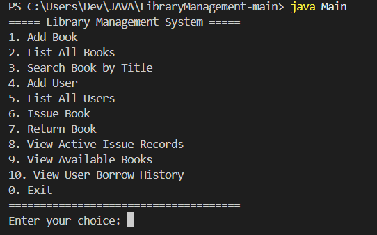

# Library Management System (Java)

## Overview
This project is a console-based Library Management System built using Java. 
It supports adding books, managing users, issuing and returning books, and viewing reports.

## Features
- Add, update, list books
- Add and list users
- Issue and return books
- View available books
- View active issue records
- View user borrowing history

## Technologies Used
- Java SE (JDK 25 LTS)
- Antigravity IDE
- Git/GitHub

## How to Run
1. Open terminal in src/ folder:
   cd src

2. Compile all files:
   javac *.java

3. Run the program:
   java Main

src/
├── Book.java 
├── User.java 
├── IssueRecord.java 
├── Library.java 
└── Main.java 

## 🖼️ Output Screenshot

Here’s a preview of the program running in the console:

## Author
Dev Juneja
23BAI10087
B.tech AIML 